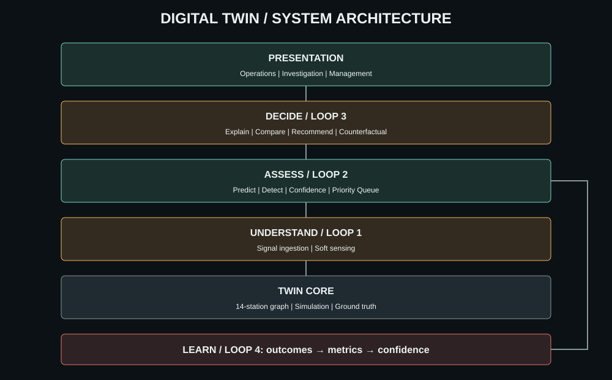

# Digital Twin

Digital Twin is a browser-based factory intelligence prototype that turns incomplete production data into a decision a team can act on. Its hero claim is decision under uncertainty: S11 has the higher raw risk, but S2 ranks first because measured evidence and downstream impact make it the stronger intervention.
This repo ships a 14-station demo slice for presentation clarity; the station graph and scoring flow are config-driven, so scaling to a 30-50 station brief is an additive station-modeling step rather than a rebuild.

## Architecture



Data flows downward-to-upward during normal operation: **Twin Core -> Understand -> Assess -> Decide -> Presentation**. The **Learn** layer is the one deliberate reverse edge: it validates outcomes against ground truth and feeds updated confidence back into Assess.

## Repository structure

```text
src/
  twin-core/      station graph, simulation ticks, scripted-ready ground truth
  understand/     signal normalization and soft sensing
  assess/         predictors and Risk x Confidence x Impact priority queue
  decide/         explanation, action comparison, recommendation, projection
  learn/          outcome validation and live metrics
  store/          one shared snapshot consumed by every view
  views/          Operations, Investigation, and Management experiences
  shared/         contracts and shared UI primitives
```

## How to run

```bash
npm install
npm run dev
```

For a production build:

```bash
npm run build
```

## Demo story

Open Operations first. The queue shows S11 with a higher raw risk, but S2 at the top because full PLC coverage and downstream impact produce stronger decision confidence. Select the prediction to inspect its weighted explanation, compare three actions, and run the counterfactual throughput projection. Investigation traces the S2/S11 divergence; Management shows S2 resolving true while S11 resolves as a false alert, and the resulting learning metrics.

## Built vs roadmap

| Prototype (built) | Production roadmap |
| --- | --- |
| 14-station, 3-zone simulated graph | PLC/MES/ERP adapters and identity management |
| Measured and soft-sensed signals | Calibrated plant-specific models |
| Explainable priority queue | Human approval and execution integrations |
| Action comparison and counterfactual projection | High-fidelity discrete-event simulation |
| Outcome validation and live metrics | Persistent event store and multi-plant tenancy |

## Model note

This prototype uses a lightweight model trained on simulated production history, represented here as transparent weighted-feature scoring so the reasoning is inspectable during the demo.

## Known limitations

There is no backend or persistence. Data is simulated, the experience runs in one browser tab, and the action projection is intentionally lightweight. The architecture leaves explicit swap-in points for real adapters and learned models.

## Team

Prototype team: add names and affiliations here before submission.

## License

MIT. See [LICENSE](LICENSE).
